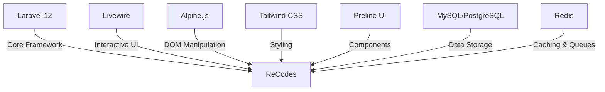

<div align="center">
  
# ReCodes


[](https://laravel.com)
[](https://livewire.laravel.com)
[](https://tailwindcss.com)

</div>

---

## 🌟 Vision

**ReCodes** isn't just another blogging platform—it's a coding journey.

This project reimagines my previous blogging platform with cutting-edge technologies and advanced features, serving as my personal playground for mastering Laravel 12 and Livewire. Every line of code represents a step toward technical excellence and creative expression.

> *"The best way to learn is to build something that challenges you."*

---

## ✨ Feature Roadmap

<div align="center">

| 🔥 Core Features | 🧠 Advanced Implementations |
|:---------------:|:-------------------------:|
| **Custom WYSIWYG Editor** | Built from javascript libraries |
| **Version Control** | Git-like history for your content |
| **Publishing Workflow** | Professional editorial process |
| **SEO Suite** | Optimize your content visibility |
| **Dynamic Taxonomy** | Organize content your way |

</div>

### 🎨 Custom WYSIWYG Editor
*Bringing ideas to life with elegant simplicity*

Forget external dependencies! Our editor is built entirely with Livewire components, offering:
- ✓ Rich formatting tools
- ✓ Image uploads with visual manipulation
- ✓ Table creation and management
- ✓ Code blocks with syntax highlighting
- ✓ Real-time preview as you type

### 🕰️ Content Time Machine
*Your words, preserved in time*

- 📝 Track every change to your articles
- 🔍 Visual diff comparison between versions
- ⏪ One-click restoration to previous versions
- 👤 Attribution tracking for every edit

### 📋 Editorial Mastery
*From draft to perfection*

- 📅 Schedule content with precision timing
- 🔄 Multi-stage workflow (Draft → Review → Published)
- 👥 Approval chains with notification system
- 👁️ Realistic preview before going live

### 🔍 SEO Intelligence
*Be discovered, be read*

- 📊 Real-time keyword analysis
- 🏷️ Smart meta tag recommendations
- 📝 AI-assisted description generation
- 📑 Advanced slug management

### 🌲 Smart Taxonomy
*Structure that evolves with your content*

- 📁 Hierarchical category structures
- 🏷️ Dynamic tagging system
- 🤖 AI-powered tag suggestions
- 🔗 Custom taxonomy relationships

### 📊 Analytics Dashboard
*Understand your audience*

Visualize your blog's performance with interactive charts and metrics, all powered by Livewire's real-time capabilities.

### 🖼️ Media Magic
*Visual storytelling made simple*

- 📸 Drag-and-drop image management
- ✂️ In-browser editing capabilities
- 🖌️ Auto-generation of responsive images
- 🎨 Organized media library with filters

### 📦 Dynamic Forms
*Extend your content model*

Create custom fields for your content with visual form builder—no coding required!

### 🏢 Multi-tenant Architecture
*One platform, infinite possibilities*

Host multiple blogs with isolated environments and custom theming under a single codebase.

---

## 🛠️ Tech Alchemy

<div align="center">



</div>

---

## 🚀 Quick Launch

```bash
# Clone the universe
git clone https://github.com/yourusername/recodes.git

# Enter the dimension
cd recodes

# Gather the elements
composer install
npm install

# Configure the portal
cp .env.example .env
php artisan key:generate

# Prepare the foundation
php artisan migrate --seed

# Awaken the interface
npm run dev

# Open the gateway
php artisan serve
```

Visit `http://localhost:8000` to enter your new digital realm!

---

## 🧪 Development Stages

<div align="center">

| Stage | Focus | Status |
|:-----:|:------|:------:|
| **I** | Core Engine & Editor | 🔄 In Progress |
| **II** | Version Control & Publishing | 📅 Planned |
| **III** | SEO & Analytics | 📅 Planned |
| **IV** | Media & Forms | 📅 Planned |
| **V** | Multi-tenancy & API | 📅 Planned |

</div>

---

## 📂 Code Architecture

```
app/
├── Http/
│   ├── Controllers/        # Traffic directors
│   └── Livewire/           # Interactive components
├── Models/                 # Data structures
├── Services/               # Business logic wizards
├── Events/                 # Signal flares
├── Listeners/              # Signal catchers
├── Policies/               # Permission guards
└── Jobs/                   # Background workers
```

---

## 🎯 Learning Objectives

This project exists to master:

- 🔄 **State Management** with Livewire
- 🧩 **Component Architecture** in modern Laravel
- ⚡ **Real-time Interactions** without heavy JavaScript
- 🔍 **Performance Optimization** techniques
- 🛡️ **Security Practices** for web applications
- 📊 **Data Visualization** with native tools

---

<div align="center">

## 🚀 Begin Your Journey

```bash
php artisan make:future
```

</div>

---

<div align="center">

**ReCodes** • Built with ❤️ and ☕ • A coding adventure by Azka

</div>
